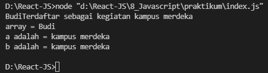
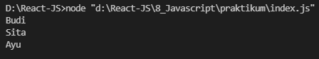
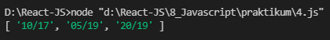
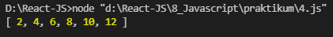
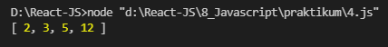

# 8 Javascript
### resume
pada resume ini saya mendapatkan beberapa poin pada materi javascript.
1. Pengenalan tentang javascript
2. Memahami pengertian var, let, const
3. Memahami declaration untuk menyimpan data

### javascript
javascript adalah bahasa yang merupakan high level dan wajib dipelajari. javascript tidak hanya digunakan di sisi client (browser) saja. javascript juga digunakan pada server, console, program desktop, mobile, IoT, game, dan lain-lain.

## task
### membuat javascript
pada task ini terdapat 6 soal pada soal no 1 disuruh untuk memperbaiki code javascript yang diberikan dan soal no 2 disuruh untuk menjelaskan kenapa code pada no 1 tidak bisa running. Dan soal no 3 sampai 6 kita disuruh untuk membuat code yang outputnya sudah ditentukan pada soal.

1. [jawaban no 1](#jawaban-no-1)
2. [jawaban no 2](#jawaban-no-2)
3. [jawaban no 3](#jawaban-no-3)
4. [jawaban no 4](#jawaban-no-4)
5. [jawaban no 5](#jawaban-no-5)
6. [jawaban no 6](#jawaban-no-6)

### jawaban no 1
```javascript
var a = 5;
let b = "kampus merdeka";
const nama = "Budi";
let terdaftar = false;
let lengkap_arr = [a, b, nama, terdaftar];

function perkenalan() {
    let asal = "indonesia";
    return console.log(
        "Perkenalkan nama saya" +
        nama +
        "nomor urut" +
        a +
        "sekarang sedang mengikuti" +
        b +
        "berasal dari" +
        asal
    );
}

terdaftar = true;
if(terdaftar === true) {
    console.log(nama + "Terdaftar sebagai kegiatan kampus merdeka");
}

a = b;
const budi = lengkap_arr.filter((budi2) => budi2 === 'budi');

console.log("array = " + nama);
console.log("a adalah = " + a);
console.log("b adalah = " + b);
```

output:



### jawaban no 2
a. dikarenakan pada baris 21, 22, dan 23 terdaftar masih bernilai false dan juga belum ada perubahan dalam code yang membuat nilai terdaftar bernilai true.

b. dikarenakan pada baris 26 ada error pada nama yang merupakan constant jika ingin menjalankan baris 26 maka harus merubah tipe variable nama menjadi let atau var.

c. tidak, dikarenakan pada line 28 terdapat variable yang di assign pada function perkenalan, jadi variable tersebut hanya bisa digunakan disana, dan hal tersebut membuat code line no 29 menjadi tidak berjalan.

### jawaban no 3
```javascript
const foo = ['Budi', 'Sita', 'Ayu'];
const [a, b, c] = foo;

console.log(a);
console.log(b);
console.log(c);
```

output:



### jawaban no 4
```javascript
let bdays = [`10-17`, `05-19`, `20-19`];
let hasil = bdays.map((item) => item.replace(`-`, `/`));
console.log(hasil);
```

output:



### jawaban no 5
```javascript
let value = [1, 2, 3, 4, 5, 6];
let hasil1 = value.map((item) => item * 2);
console.log(hasil1);
```

output:



### jawaban no 6
```javascript
let arr = [1.5, 2.56, 5.1, 12.33];
let pembulatan = arr.map((angka) => Math.round(angka));

console.log(pembulatan);
```

output:

