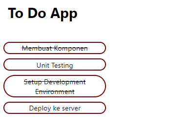

# 11 React Fundamental

### resume

Pada section ini saya mendapatkan beberapa poin penting didalamnya.

1. mengenal JSX pada React JS
2. mengenal React Components
3. mengetahui style inline pada React JS

## task

### membuat ToDoList

pada task ini telah terbuat sebuah halaman web dengan react js. Pada halamannya jika pada mock datanya mempunyai boolean true maka listnya akan tercoret. berikut merupakan source codenya dan juga hasilnya.

[ToDoList.jsx](./praktikum/my-app/src/pages/components/ToDoList.jsx)

output:

