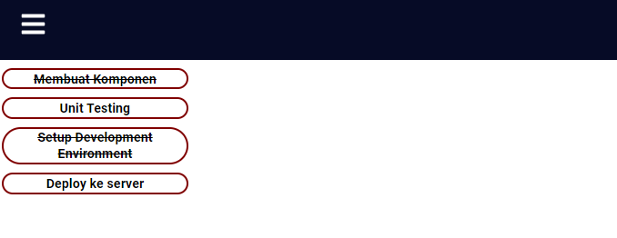
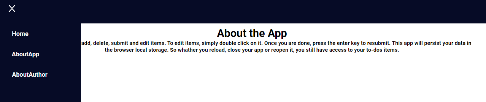
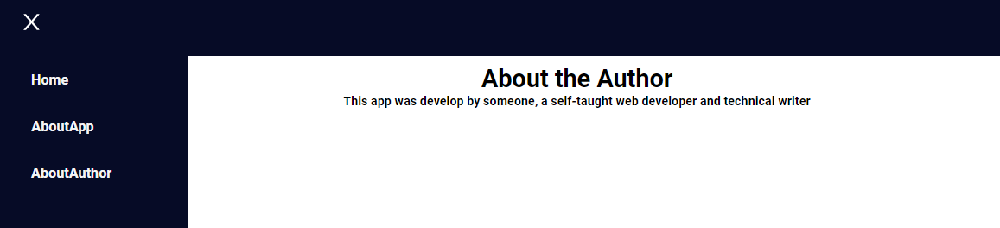

## 12 Reac Routing

### Resume

Pada section ini saya mendapatkan beberapa poin pentingnya yaitu ada:

1. melakukan routes untuk navigasi perpindahan halaman
2. mengenal multi-page app dengan single-page app
3. keunggulan dan kekurangan multi-page app dengan single-page app
4. mengenal parameter URL dan kegunaannya
5. mengenal Link tag pada React

### React Routing

Routing atau Router merupakan modul dalam react yang berfungsi untuk melakukan proses navigasi web

## task

### Membuat Routing

Pada task ini telah terbuat sebuah web yang menggunakan modul Routing untuk dapat berpindah halaman pada web. Hasilnya sourcodenya dapat dilihat pada link dibawah.

[my-app](../11_React%20Fundamental/praktikum/my-app)

Hasilnya dapat dilihat dibawah.

1. Home

Output:

2. About App

Output:

3. About Author

Output:

4. Not Found

Output:

