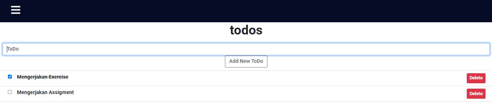
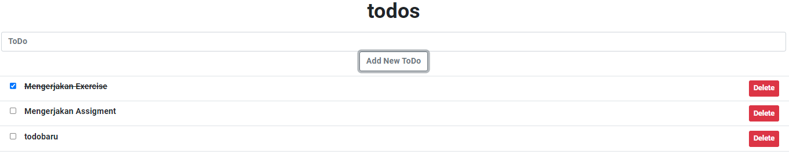
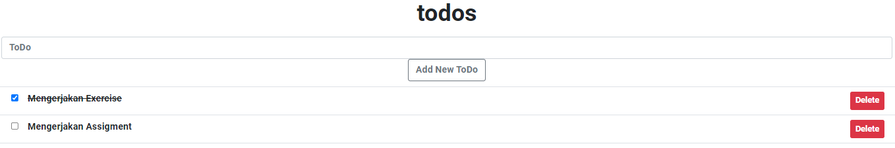

## 13 Event Handling

### resume

pada section ini saya mendapatkan poin-poin penting yaitu ada:

1. Mempelajari component state
2. Menggunakan list event berupa OnSubmit, OnChange, dan OnSubmit
3. mengetahui perbedaan tipe component stateless dengan statefull

## task

### membuat todos list

pada task ini telah terbuat todo list yang dimana pengguna dapat menambahkan todo, mengcheck list todo jika sudah selesai, dan delete todo.
outputnya dapat dilihat pada screenshot dibawah:

#### todos

output:

#### add todos

output:

#### delete todos

output:

