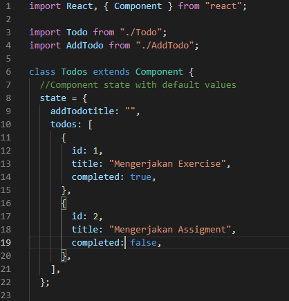
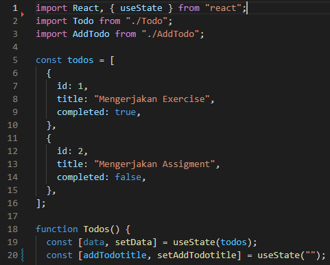
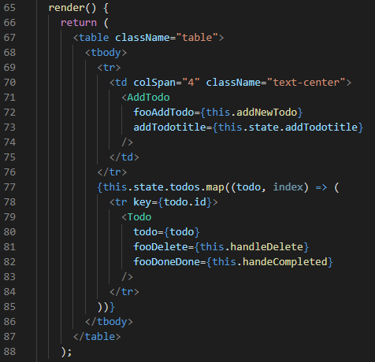
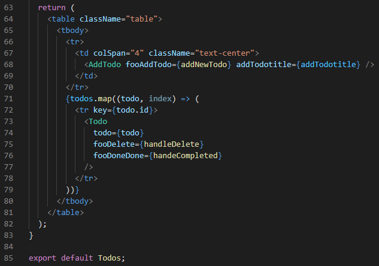
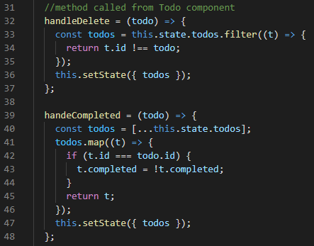
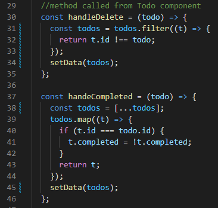

## 14 React Hook

### resume

Pada section 14 yang mengenai materi react hook ini, saya mendapatkan beberapa poin penting dalam materinya.
Berikut merupakan poin penting yang saya dapatkan:

1. Pengenalan fitur react hook
2. Implementasi useState & useEffect dalam component
3. Pembuatan custom hook
4. Memahami pemanggilan fungsi hook

### react hook

Hooks merupakan fitur baru di React 16.8. Dengan Hooks, kita dapat menggunakan fitur hook yang terbilang cukup mudah dikarenakan menggunakan state dan fitur React yang lain tanpa perlu menulis sebuah kelas.

## task

### mengkonversi component class ke function

pada task ini telah mengkonversi component class menjadi component function. pada proses konversinya sangat sungguh sulit dikarenakan ada banyak component didalam class yang sungguh banyak.
berikut merupakan perubahan component class menjadi function:

#### class menjadi function

pada gambar dibawah merupakan perubahan component class menjadi function.

#### render menjadi return

pada gambar dibawah merupakan perubahan render pada class menjadi function return.

#### Handler

pada gambar dibawah merupakan perubahan handler menjadi const handler.

