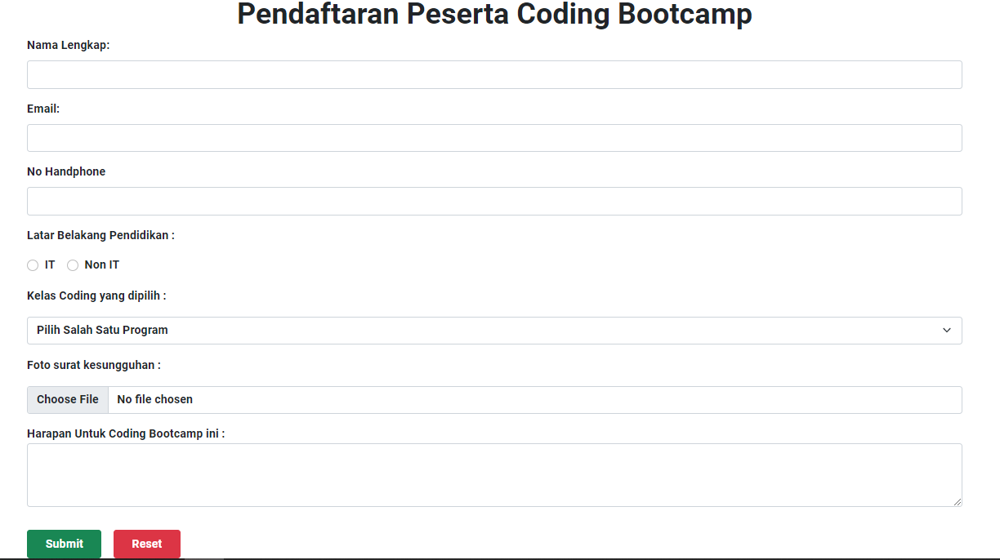
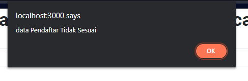
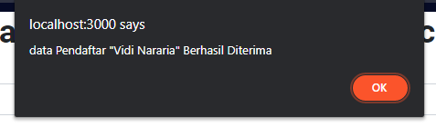

## 15 React Form

### resume

pada section ini saya mendapatkan beberapa poin penting didalamnya.
berikut poin penting yang saya dapatkan:

1. Mengetahui pembuatan form
2. Mengetahui perbedaan Component Controlled dengan Uncontrolled component
3. Mengetahui Validasi jika pada form meninginkan data yang benar

## task

### membuat form pendaftaran

pada task ini telah terbuat form pendaftaran, jika pengguna memasukkan data diri maka data akan terinput. jika si pengguna memasukkan data nama tetapi pengguna memasukkannya berupa angka maka akan ada alert. jika si pengguna tidak memasukkan file pada kolom file maka akan ada alert bahwa file belum terinput.
tampilannya dapat dilihat pada gambar dibawah ini:

1. [Tampilan](#tampilan)
2. [Alert salah](#alert-salah-memasukkan-data)
3. [Alert data berhasil](#alert-data-terinput)

#### tampilan

output:

### alert salah memasukkan data

output:

### alert data terinput

output:

