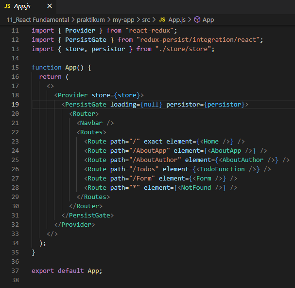
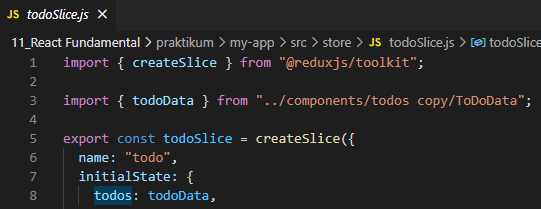
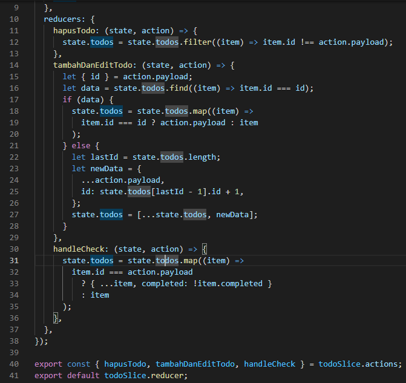
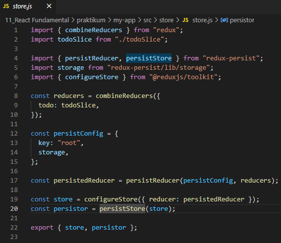
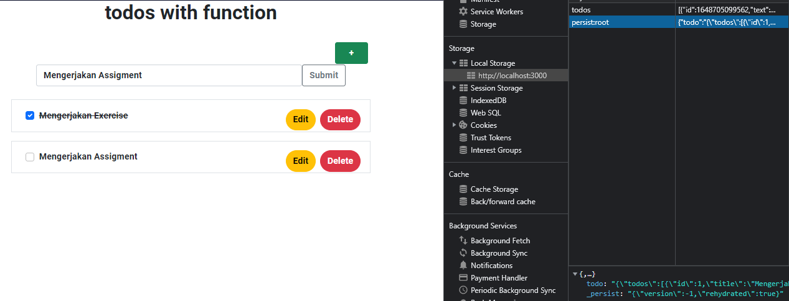
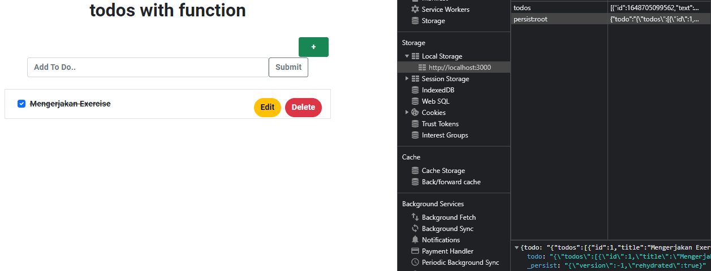

## 16 Global State Management and Data fetching

### resume

pada section ini saya mendapatkan beberapa poin penting didalamnya.
berikut poin penting yang saya dapatkan:

1. Mengenal tentang apa itu Global state dan data fetching
2. Mengetahui kapan menggunakan redux dan mengetahui library dan toolsnya
3. Penggunaan Hooks dan Connect untuk memakai dan mengubah state redux
4. Penggunaan thunk middleware untuk redux yang memungkinkan untuk membuat action, creator yang mengembalikan function
5. Penggunaan persist untuk penyimpanan state ke storage

## task

### mendambahkan redux pada project sebelumnya

pada task ini telah menambahkan redux pada project react sebelumnya.

#### memasukkan provider komponen

pertama memasukkan komponen `<Provider />` untuk membuat redux store tersedia di app project react

#### menambahkan store dan Slice

##### menambahkan todoSlice

##### menambahkan store

#### application

jika dilihat dari application pada browser sudah ada persist pada local storage.

#### hapus todo

jika salah satu todo dihapus dan halaman web direfresh maka datanya yang barusan dihapus tetap tidak ada.

