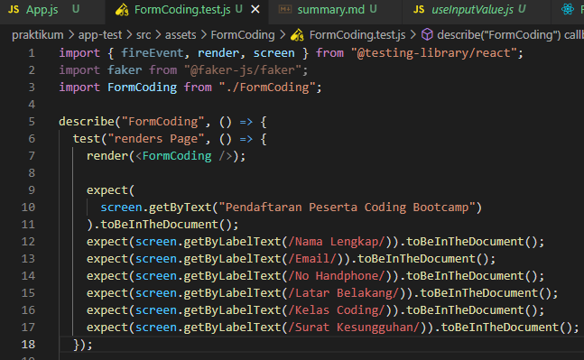
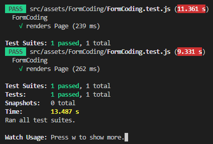
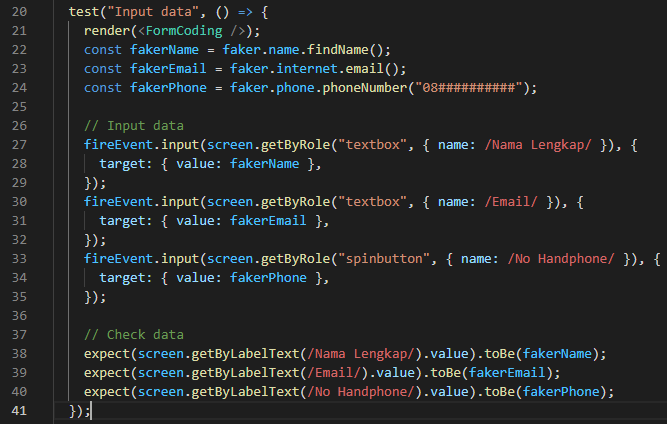
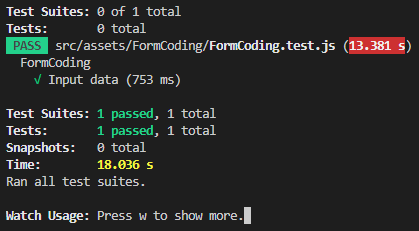
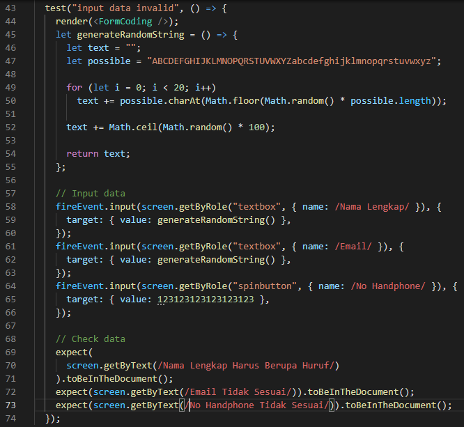
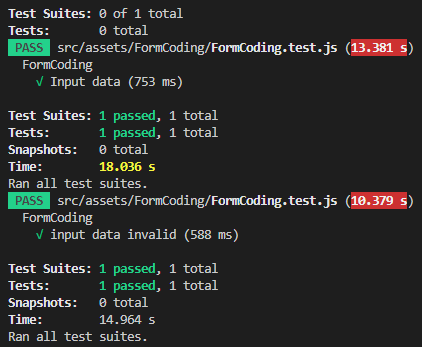
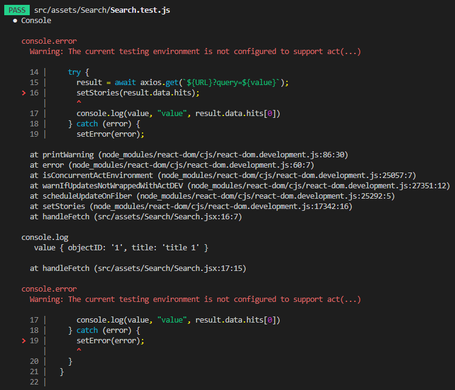
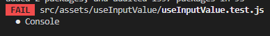
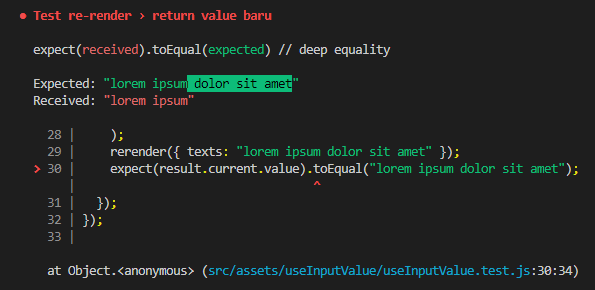

## 17 Testing

### resume

Pada section ini saya mendapatkan beberapa poin penting yang bisa di jadikan ringkasan.
Berikut point penting-pentingnya:

1. Mengetahui testing pada react js yang diperlukan untuk mengetahui test assertions kita benar dan code kita tetap benar sepanjang masa aplikasi.
2. Mengetahui manfaatnya menggunakan testing seperti mengurangi bug dalam aplikasi.
3. Mengetahui Rendering component tress Di dalam environment tes yang sudah disederhanakan dan tegaskan pada keluarannya.

### task

Pada task ini disediakan kode yang disuruh untuk kita testing dari kode tersebut. Berikut beberapa hasil screenshot testingnya:

1. [FormCoding test](#formcoding-test)
2. [Search test](#search-test)
3. [useInputValue test](#useinputvalue-test)

#### FormCoding test

##### render page

##### input data

##### input data invalid

#### Search test

#### useInputValue test

