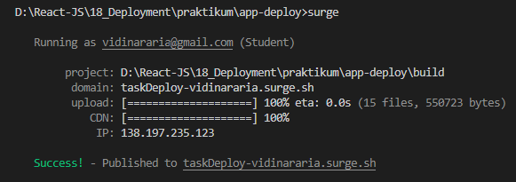
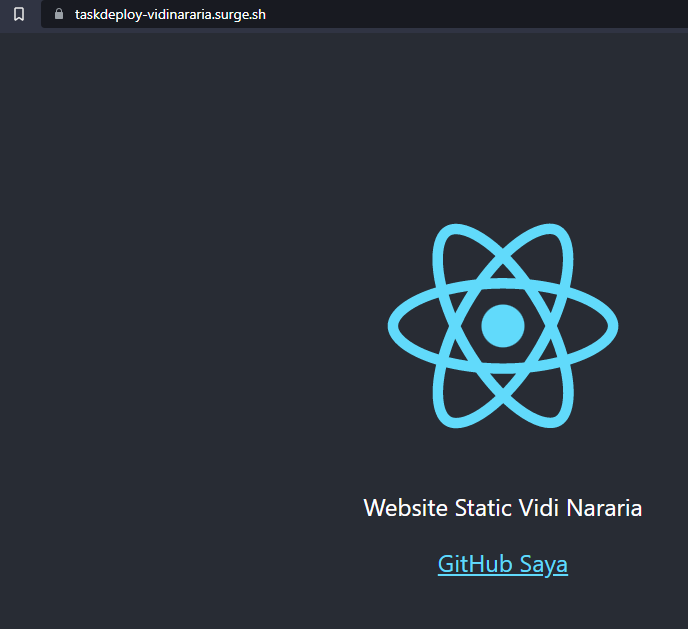

## 18 Deployment

### resume

pada section ini mendapatkan poin-poin penting didalamnya berikut poin-poin pentingnya:

1. melakukan build app untuk menggunakan versi produksi ketika men-deploy aplikasi.
2. memahami deployment dalam menyebar aplikasi
3. penggunaan surge untuk deployment
4. penggunaan netlify untuk deployment

### task

pada task ini telah terlaksana pembuatan project static react yang di deploy dengan menggunakan surge. berikut merupakan hasilnya

1. [Deploy](#deploy-dengan-surge)
2. [Hasil](#hasil)

#### Deploy dengan Surge

#### Hasil

pada gambar dibawah ini telah berhasil untuk deploy web static denga domain taskDeploy-vidinararia.surge.sh

