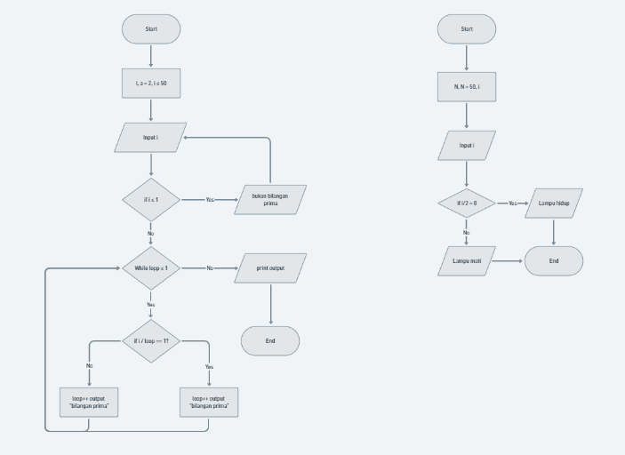

## 19 Inrorduction Algorithm

### resume

pada section ini saya mendapatkan beberapa poin-poin penting didalamnya. berikut poin-poin pentingnya:

1. Pengenalan algoritma yang merupakan prosedur komputasi contohnya seperti sorting, searching, dan lain-lain.
2. Mempelajari algoritma dasarnya pada flowchart.
3. Memahami Pseudo Code untuk mudah dibaca dan dipahami dari algoritma.

### task

pada task ini disuruh untuk membuat diagram flowchart dari soal yang telah diberikan dari tugas. tugasnya dilihat pada link berikut:

https://whimsical.com/7qbf3fpL2wKsZWZ6Q2DNVP

screenshot hasilnya:

