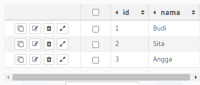
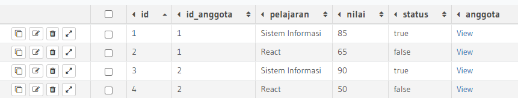
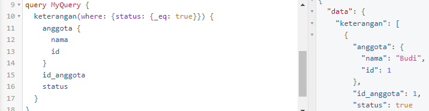
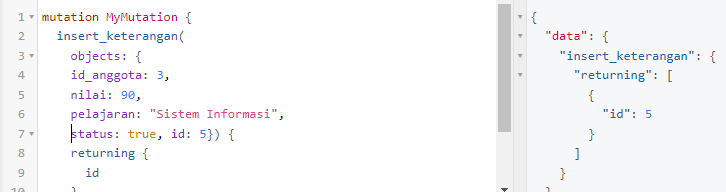
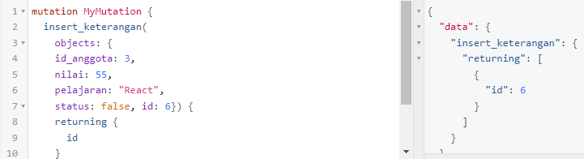
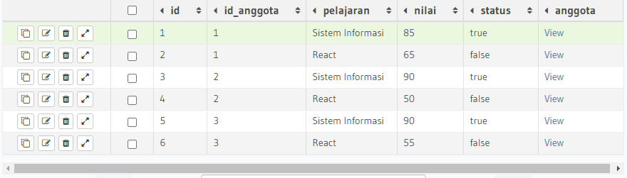
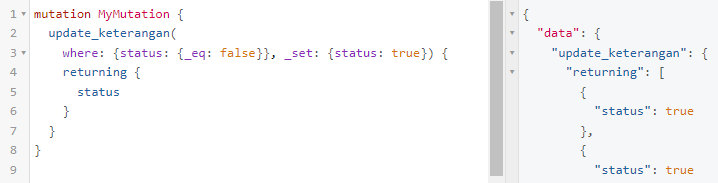
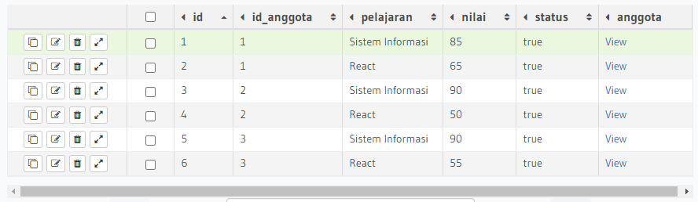

## 20 GraphQL - Basic

### resume

pada section ini saya mendapatkan beberapa poin-poin penting. berikut poin-poin yang saya dapatkan:

1. pengertian graphql untuk API dan server.
2. terdapat 3 fitur pada graphql yaitu query untuk mendapatkan data dari spesifik query yang kita define, mutation berupa insert update delete, dan subscription untuk mendapatkan data secara realtime.
3. melakukan setup hasura sebagai pembelajaran dan juga apollo server sebagai library untuk javascript.

### task

pada task ini diberikan soal yang disuruh menyelesaikannya dengan membuat database pada website bernama hasura.

1. [Membuat tabel anggota dan insert datanya](#membuat-tabel-anggota-dan-insert-datanya)
2. [Membuat tabel keterangan dan insert datanya](#membuat-tabel-keterangan-dan-insert-datanya)
3. [Memanggil siswa dengan status true menggunakan query](#memanggil-siswa-dengan-status-true-menggunakan-query)
4. [Insert data pada angga menggunakan mutation](#insert-data-pada-angga-menggunakan-mutation)
5. [Update data dengan status false menggunakan mutation](#update-data-dengan-status-false-menggunakan-mutation)

#### Membuat tabel anggota dan insert datanya

#### Membuat tabel keterangan dan insert datanya

#### Memanggil siswa dengan status true menggunakan query

#### Insert data pada angga menggunakan mutation

hasil:

#### Update data dengan status false menggunakan mutation

hasil:

