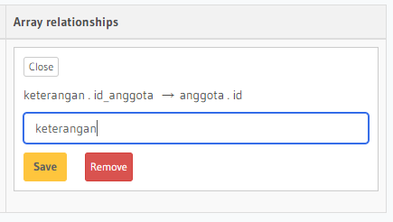

## 21 Relational Database

### resume

pada section 21 tentang relational database ini, saya mendapatkan beberapa poin-poin penting. berikut poin-poin yang saya dapatkan:

1. pengenalan database
2. mengenal jenis database relationship
3. mengenal jenis perintah SQL

### task

pada task ini diberikan soal untuk melakukan relasi pada tabel anggota dengan tabel keterangan. berikut merupakan hasilnya:

1. [Onet to One](#one-to-one)
2. [One to Many](#one-to-many)

#### One to One

pada relasi one to one ini disuruh untuk mengabungkan kolom id_anggota pada tabel keterangan dengan kolom nama pada tabel anggota. hasilnya dapat dilihat pada gambar dibawah ini.

pertama menambahkan foreign key pada kolom id_anggota ke tabel anggota pada kolom id

menambahkan object relationships

maka pada tabel keterangan akan ada kolom baru bernama kolom anggota jika di klik view maka akan muncul relasi tabel keterangan.anggota

#### One to Many

pada relasi One to Many ini disuruh untuk mengabungkan kolom id pada anggota dengan kolom pelajaran pada tabel keterangan. hasilnya dapat dilihat pada gambar dibawah ini.

pertama menambahkan relasi pada arrary relationships

setelah menambahkan arrary relationship maka akan ada kolom keterangan pada tabel anggota jika di klik view maka akan muncul tabel keterangan dari salah satu anggota.

