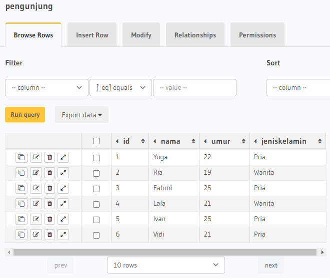
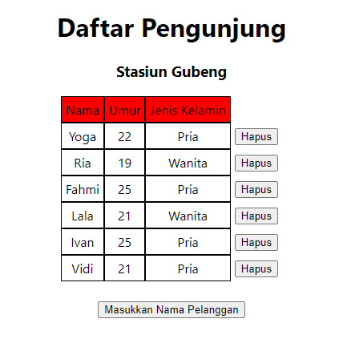

## 22 GraphQL – Query and Apollo client

### resume

Pada section 22 ini saya mendapatkan beberapa poin - poin penting pada section ini. berikut poin - poin pentingnya:

1. Menggunakan Query dan Apollo client untuk menggambil data pada hasura
2. Melakukan setup Apollo client
3. Mengetahui fetch data

### task

Pada task ini diberikan project react yang nantinya disuruh untuk menghubungkannya dengan GraphQL. Berikut hasilnya dapat dilihat pada screenshot dibawah ini.

Data pada tabel

Data tampil pada project react

