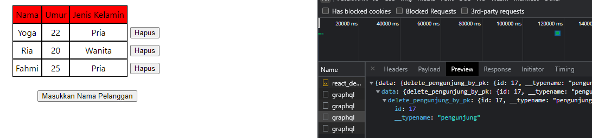

## 23 GraphQL – Mutation

### resume

Pada section 23 ini saya mendapatkan beberapa poin - poin penting didalamnya. Berikut poin - poin pentingnya:

1. Menggunakan useMutation untuk melakukan Insert, Delete, dan Update.
2. Penggunaan refetchQueries dan refetch untuk melakukan refresh pada aplikasi jika mengalami perubahan.
3. Penggunaan mutation handler yang nanti dipanggil di variables.

### task

Pada task ini disuruh untuk membuat fitur submit dan fitur delete dengan menggunakan project react yang telah dibuat sebelumnya. Berikut hasil

#### Insert

#### Delete

