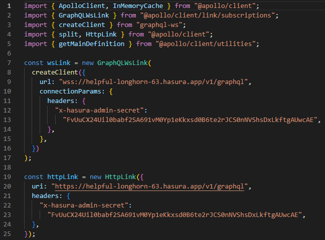
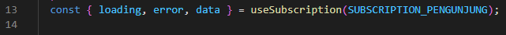

## 24 GraphQl - Subscription

### resume

Pada section 24 ini saya mendapatkan beberapa poin - poin penting didalamnya. Berikut poin - poin penting didalamnya:

1. Penggunaan useSubscription untuk mendapatkan data secara cepat
2. Melakukan setup websocket untuk subscription
3. Penggunaan subscriptionToMore untuk mengeksekusi subscription

### task

Pada task ini disuruh untuk menerapkan subscription pada project yang telah dibuat sebelumnya. Berikut hasil penerapannya:

#### initialize GraphQLWsLink

#### Penggunaan useSubscription

