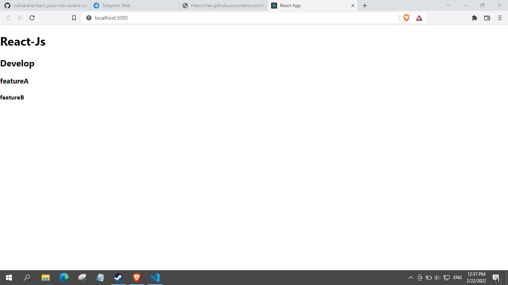

# 2 Version Control and Branch Management (Git)
### Resume
Pada resume yang saya tulis ini pada materi yang berjudul Version Control and Branch Management (Git).
Tiga poin yg saya temukan setelah saya mempelajari materinya adalah:
1. Mengenal apa itu versioning
2. Mempelajari version control system yg populer yaitu git yang banyak digunakan oleh developer
3. Melakukan setup pada git server sendiri

### Version Control
Versioning control atau bisa dikenal souce control, adalah praktik tracking dan managing perubahan pada software code.
Version control system merupakan software tool untuk membantu software team dalam managing perubahan dalam souce code dalam berkala.

### Penggunaan Version Control pada React Js
Pada versioning control untuk react js dengan menggunakan node.js yang digunakan untuk menjalankan aplikasi web berbasis javascript.

## task
### Membuat React Js
Pada task ini telah terbuat sebuah git server sendiri dengan berisi file react js. Git server ini merupakan hasil pembelajaran dari versioning control.
Berikut hasil code dari praktikum ini.

[index.js](./praktikum/web-react-saya/src/index.js)

Output:

