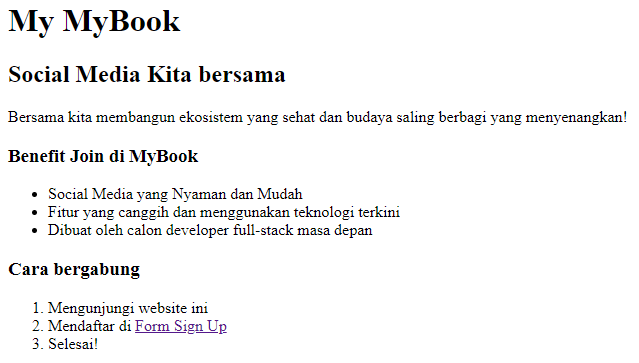
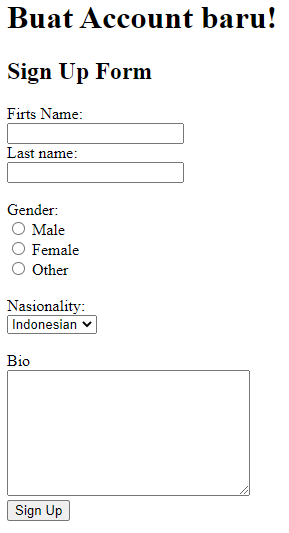

# 5 HTML
### resume
Pada materi section 5 ini saya menemukan beberapa point penting didalamnya.
1. Mengenal apa itu front-end dan back-end.
2. Mengenal apa itu HTML.
3. Mempelajari Tag atau syntax pada HTMl.

### html
html atau kepanjangannya Hypertext Markup Language adalah sebuah bahasa pemrograman yang pada umumnya digunakan untuk menampilkan halaman web. Dengan berbagai macam tag dibuat maka akan terbentuk tampilannya yang dapat dilihat melalui local browser yang digunakan.

## task
### Membuat html
Pada task ini telah terbuat sebuah 3 file html untuk membuat form sign up, berikut merupakan hasilnya.
1. [index.html](#indexhtml)
2. [form.html](#formhtml)
3. [welcome.html](#welcomehtml)

#### index.html
```html
<!DOCTYPE html>
<html>
    <head>
        <title>My Book</title>
    </head>
    <body>

        <h1>My MyBook</h1>
        <h2>Social Media Kita bersama</h2>
        <p>Bersama kita membangun ekosistem yang sehat dan budaya saling berbagi yang menyenangkan!</p>
        <h3>Benefit Join di MyBook</h3>
        <ul>
            <li>Social Media yang Nyaman dan Mudah</li>
            <li>Fitur yang canggih dan menggunakan teknologi terkini</li>
            <li>Dibuat oleh calon developer full-stack masa depan</li>
        </ul>
        <h3>Cara bergabung</h3>
        <ol>
            <li>Mengunjungi website ini</li>
            <li>Mendaftar di <a href="form.html">Form Sign Up</a></li>
            <li>Selesai!</li>
        </ol>

    </body>
</html>
```

Output:


#### form.html
```html
<!DOCTYPE html>
<html>
    <head>
        <title>Form Sign Up</title>
    </head>
    <body>
        <h1>Buat Account baru!</h1>
        <h2>Sign Up Form</h2>
        <form action="welcome.html">
            <label for="fname">Firts Name:</label><br>
            <input type="text" id="fname" name="fname"><br>
            <label for="lname">Last name:</label><br>
            <input type="text" id="lname" name="lname">
            <br>
            <br>
            <label for="Gender">Gender:</label><br>
            <input type="radio" id="Male" name="Male" value="Male">
            <label for="Male">Male</label><br>
            <input type="radio" id="Female" name="Female" value="Female">
            <label for="Female">Female</label><br>
            <input type="radio" id="Other" name="Other" value="Other">
            <label for="Other">Other</label>
            <br>
            <br>
            <label for="Nasionality">Nasionality:</label><br>
            <select id="Nasionality" name="Nasionality">
                <option value="Indonesian">Indonesian</option>
                <option value="American">American</option>
                <option value="Russian">Russian</option>
            </select>
            <br>
            <br>
            <label for="Bio">Bio</label><br>
            <textarea id="Bio" name="Bio" rows="8" cols="30"></textarea>
            <br>
            <input type="submit" value="Sign Up">
        </form>
    </body>
</html>
```

Output:


#### welcome.html
```html
<!DOCTYPE html>
<html>
    <head>
        <title>Welcome</title>
    </head>

    <body>
        <h1>SELAMAT DATANG!</h1>
        <h2>Terima Kasih telah bergabung di MyBook. Social Media kita bersama!</h2>
    </body>
</html>
```

Output:


