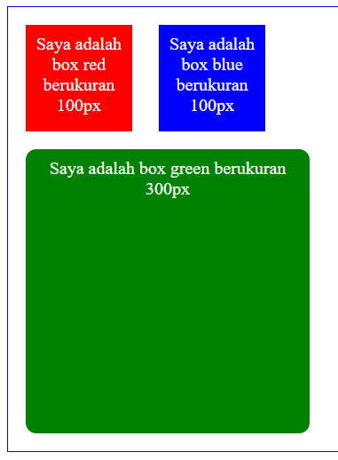
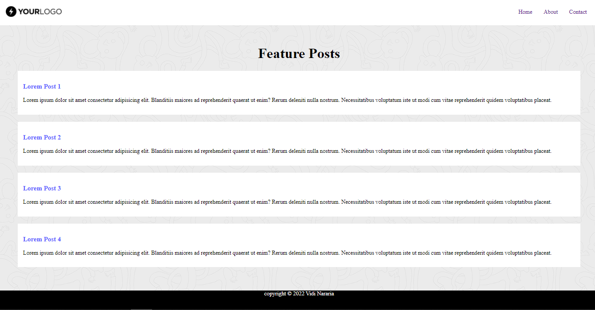

# 6 CSS
### resume
pada materi section 6 ini saya menemukan beberapa poin penting didalamnnya.
1. Mengenal apa itu CSS
2. Mengenal CSS Selector
3. Mengenal pembuatan CSS Inline, External, dan Internal
4. Mendesain tampilan HTML dengan CSS

### CSS
CSS atau kepanjangannya Cascade Style Sheet adalah bahasa kedua dari HTML, CSS sangatlah penting bagi web developer untuk membuat tampilan menjadi lebih baik. Pada CSS kita dapat mengatur tata letak warna, font, garis, dan lain-lain.

## task

1. [Membuat Kotak dengan CSS](#membuat-kotak-dengan-css)
2. [Membuat tampilan web dengan CSS](#membuat-tampilan-web-dengan-css)

### Membuat Kotak dengan CSS
Pada task pertama ini disuruh untuk mengubah tampilan dari file html yang telah diberikan. task pertama ini saya memakai CSS Internal dikarenakan tidak banyak tampilan yang perlu saya gunakan.

Berikut merupakan file dan juga Screenshot hasilnya.
[file1.html](./praktikum/file1.html)

Output:

### Membuat tampilan web dengan CSS
Pada task kedua ini disuruh untuk membuat tampilan web yang sudah diberikan dengan background pattern dan juga logo pada web. task kedua ini saya memakai CSS External dikarenkan banyak tampilan yang harus dibuat.

Berikut merupakan file dan juga hasilnya.
[file2.html](./praktikum/file2.html)

Output:
