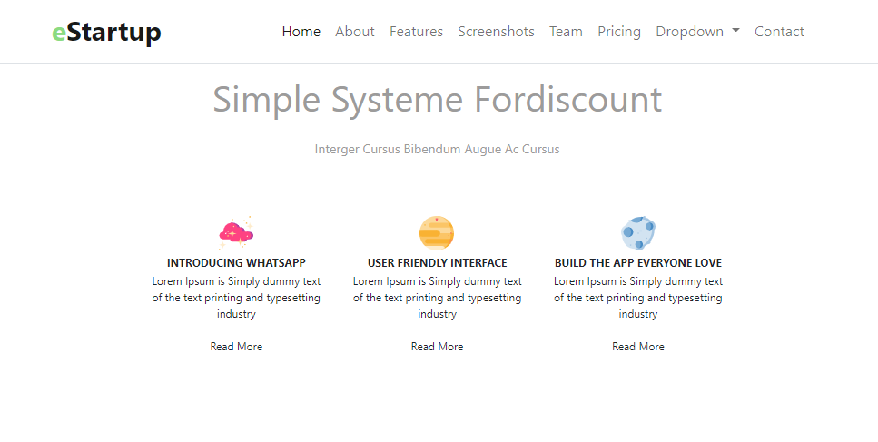
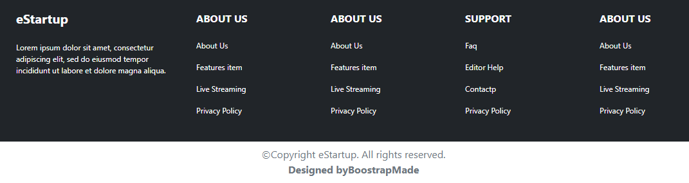

# 7 Bootstrap
### resume
Pada materi section 7 ini saya menemukan beberapa poin penting didalamnya.
1. Mengenal Bootstrap
2. Membuat halaman dashboard atau welcome page
3. Membuat Contact page

### Bootstrap
Bootstrap merukapan framework yang free dan open-source yang digunakan untuk membuat halaman web site agar semakin mudah.

## task
pada task ini telah terbuat sebuah halaman website dengan menggunakan bootstrap sebagai framework.

1. [Membuat Navbar](#membuat-navbar)
2. [Membuat Main Content](#membuat-main-content)
3. [membuat footer](#membuat-footer)

### Membuat Navbar
pada bagian awal ini disuruh untuk membuat navbar dengan bootstrap.
Berikut merupakan file dan hasilnya.

[index.html](./praktikum/index.html)

Output:

### Membuat Main Content
Pada bagian ini telah terbuat main dengan berisi contentnya.

[index.html](./praktikum/index.html)

Output:

### Membuat Footer
pada bagian ini telah terbuat footer.

[index.html](./praktikum/index.html)

Output:

